# Transporters

# Public Transport App 

https://www.youtube.com/watch?v=vwJnoGSXmvM&feature=youtu.be
https://hackerspace.govhack.org/projects/public_transport_app

The purpose of this app is to make it easier for general public to plan their trip when using public transport. The idea behind this app is to influence people
to take public transport, reduce air pollution, less environmental damage and reducing petrol usage. This app is directed for smaller cities such as Taupo, Gisborne
Hawkes Bay, Palmerston North, Wairoa and other smaller regions. These smaller cities are lacking a service that provides clear information about the public transport 
in their regions. This solution is aimed for students, working people, elderly and event-goers.
This app was created solely for regional councils to keep track of their bus drivers, buses and public feedback.
As this app progresses, it can be expanded to add other public transports such as trains, ferry and airplanes. 

# Logo

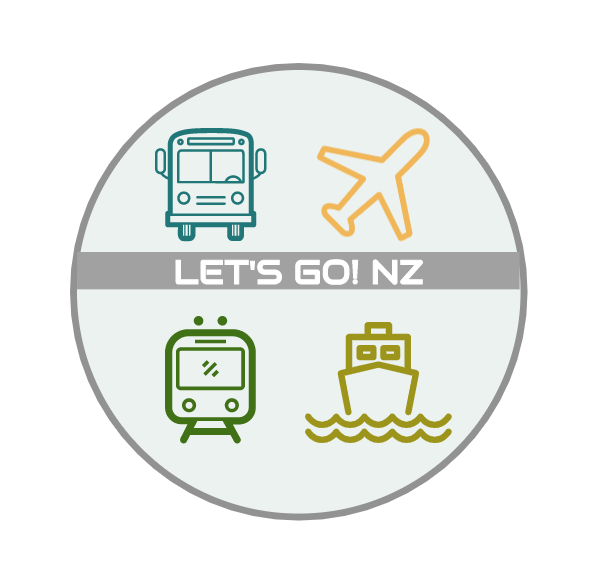

# Mockup

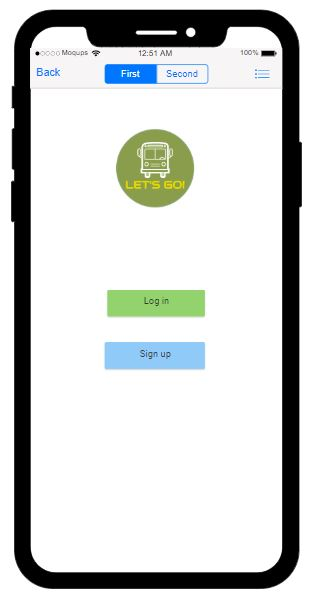
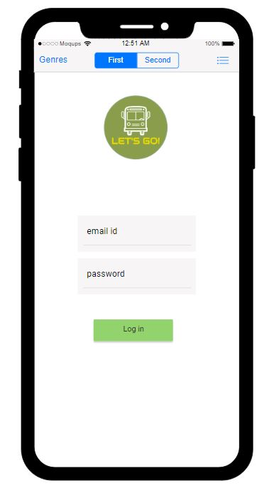
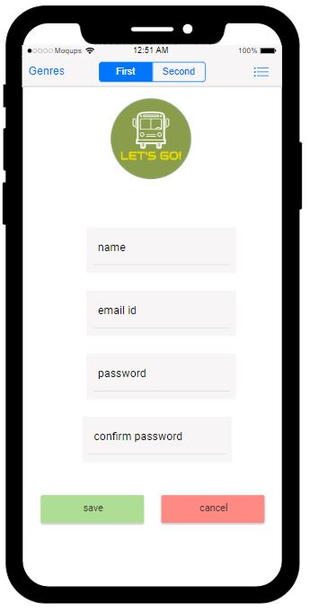
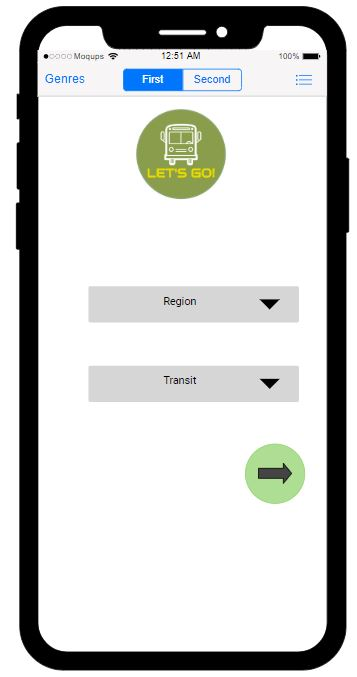
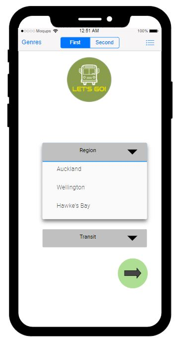
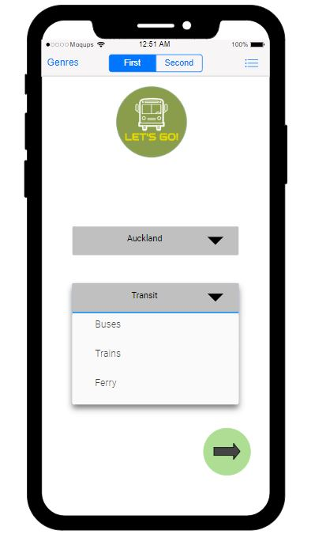
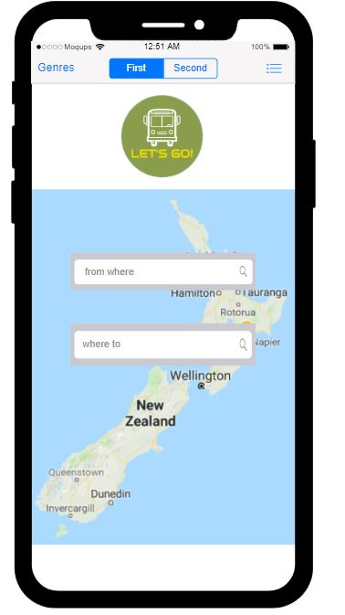
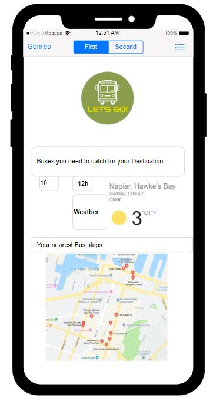
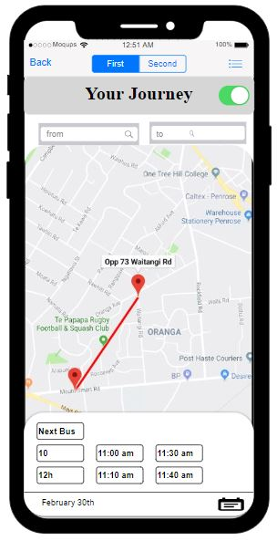
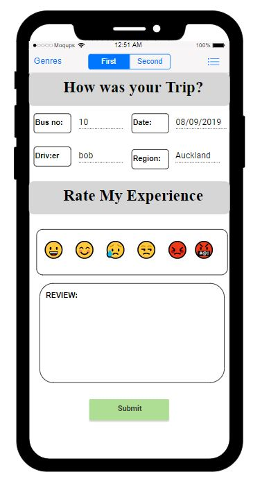
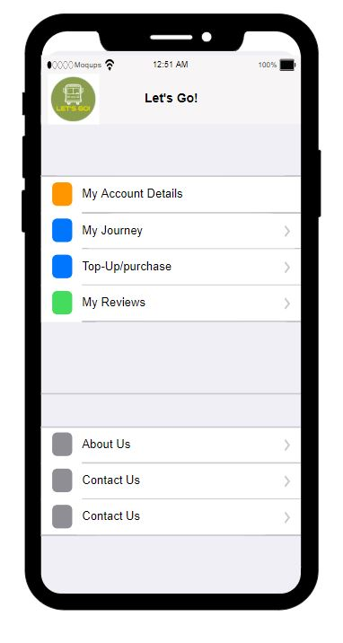

# Team Photo

### Technology
+ React Native
+ API's
+ Using Sensors in React Native
+ JWT Auth (Local)
+ SVG
+ Postman
 
 ---
 ### User Stories

 #### MVP
+ As a user I want to be able to .. track my bus in real time.

+ As a user I want to be able to .. get ETA for public transport.

+ As a user I want to be able to .. plan my trip.

+ As a user I want to be able to .. record and save my daily journey/commute.

+ As a user I want to be able to .. top-up my card through the app.

+ As a user I want to be able to .. give reviews on my experience of my journey/commute.

+ As a user I want to be able to .. retrieve information about my bus.

---

#### Stretch

+ As a user I want to be able to .. retrieve information about ferry, train and airplanes.

+ As a user I want to be able to .. sync my flight details in my calendar to this app.

+ As a user I want to be able to .. show the prefered mode of public transportation to travel depending on where they're going.

+ As a user I want to be able to .. depending on time of day and for user, show hourly weather update

### Team DataSets

## API - Real time bus tracker (Auckland)
request url 
https://api.at.govt.nz/v2/gtfs/routes

HTTP request
GET https://api.at.govt.nz/v2/gtfs/routes HTTP/1.1
Host: api.at.govt.nz
Ocp-Apim-Subscription-Key:top secret

## API -Real time weather data (e.g.Napier)

API call
api.openweathermap.org/data/2.5/weather?q={city name},{country code}

 ----

 ## Views

  | components | purpose |
  | --- | --- |
  | Landing | View of opening page with logo |
  | The Tranporter Logo | The Tranporter logo svg |
  | InstructionContainer | Holds the Menu and Welcome instructions |
  | WelcomeInstruction  | View with welcome message on first open of app |
  | MenuInstruction | View with menu instructions (use of app) on first open on app |
  | Home | View to contain initial page with nav bar buttons |
  | NavBar | View for navigation buttons |
  | Weather  | View to see weather in your area |
  | Bus Stops List | Shows the bus stops in your area and on a map |
  | Bus Details | Shows more details on the specific bus and the waiting time |

  | name | purpose |
  | --- | --- |
  | General Transit Feed (GTFS)| List of the transit agencies that provide the data in this feed |
  | Weather query API| Search for your local weather |
  | ## | ###  |
 
---
